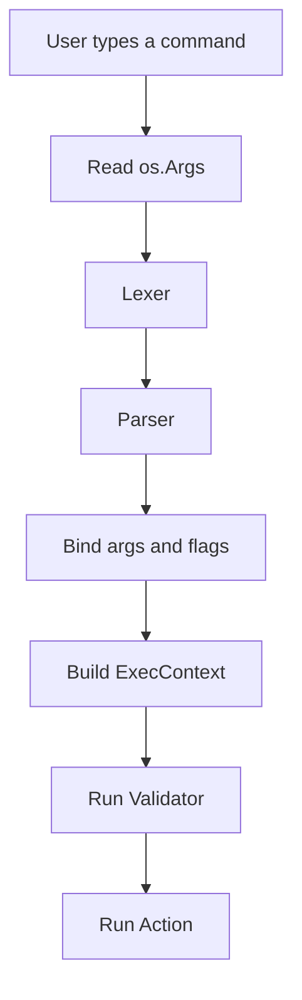

# Architecture

This page explains the moving parts in plain language.

## The Main Pieces

- `Command` describes what the CLI can do.
- `CmdLexer` and `CmdParser` read the raw command line.
- `bind` connects parsed tokens to your typed args and flags.
- `ExecContext` is what your validator and action receive.
- `CliError` is how the library tells you what went wrong.

## How A Command Runs

## What The Design Is Trying To Do

- Keep the public API small enough to understand quickly.
- Make the command tree easy to read in code.
- Keep type-safe access to values simple.
- Give users built-in help instead of forcing every app to build its own.

## In Practice

If you can describe a command in one or two structs, CCL is a good fit. If the CLI needs a lot of dynamic behavior before the parser can even decide what the command is, you may need a more flexible layer on top.
